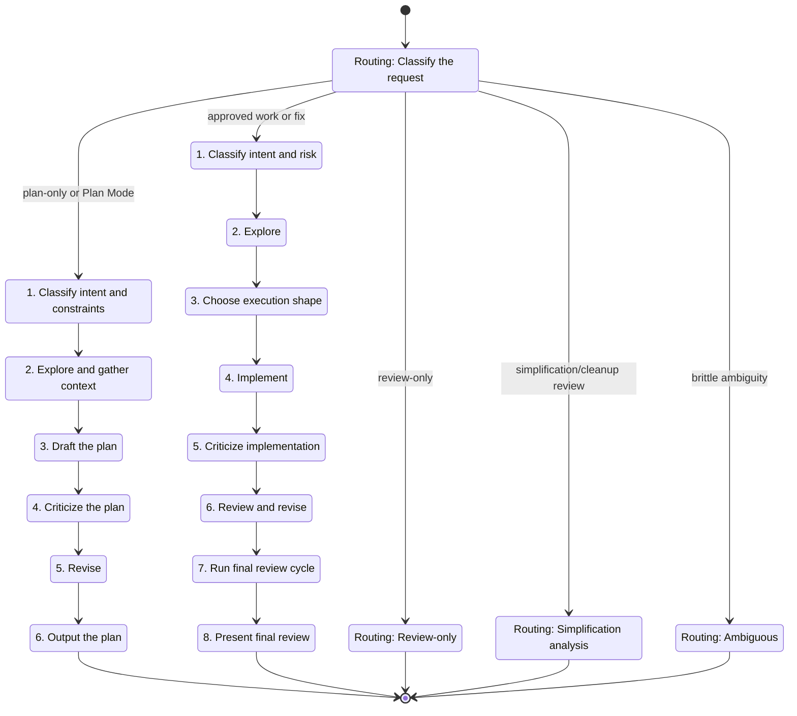

# Coordinator

Coordinate engineering work through one of two workflows:

- **Plan Coordination**: explore, gather context, draft a plan, criticize it, revise it, and output the plan.
- **Implementation Coordination**: explore, implement, criticize, review, revise, run a final review cycle, and present the result.

Keep the main thread responsible for routing, scope control, review, acceptance, and synthesis. Use the lightest workflow that safely fits the task, but do not silently collapse requested coordinator, delegation, or role-based work into ordinary local execution.

## Required Companion

This skill works best with Superpowers installed. Some routes intentionally hand off to `superpowers:*` skills for specialized planning or execution discipline.

If a referenced `superpowers:*` skill is unavailable, say:

> Superpowers is not available; falling back to default planning behaviour.

Then continue with the closest safe default workflow. Do not pretend that Superpowers was used.

For pure written planning when `superpowers:writing-plans` is unavailable, produce a compact default plan that satisfies the active Plan Mode contract: title, summary, key changes, test plan, assumptions, and no file mutations.

## Routing

Classify the request before substantial work:

- **Plan-only or Plan Mode**: use Plan Coordination. Do not mutate files. Pure written implementation plans route to `superpowers:writing-plans` when available.
- **Implementation, fix, debug, refactor, CI, cleanup, or approved plan execution**: use Implementation Coordination unless the task is a one-line mechanical edit.
- **Simplification analysis**: route broad cleanup, reuse, efficiency, overcomplication, dead-code, redundant-test, redundant-style, and Fallow-backed maintainability review requests to `$workflow:simplification-review`.
- **Review-only**: stay read-only. Gather evidence and report findings; do not implement unless the user asks.
- **Investigation**: gather evidence first. Continue to implementation only when the fix path is concrete.
- **Ambiguous**: ask only when guessing would make the result brittle or incorrect.

Treat prompts like "implement this plan", "execute this plan", "build this", "make these changes", "apply the plan", or "carry this out" as Implementation Coordination unless the task is obviously tiny.

## State Machine

The diagram is a companion. Every state label maps directly to a routing rule or to the exact title of a numbered workflow step below.

## Workflow 1: Plan Coordination

Use this for Plan Mode, plan-only requests, investigation plans, and design coordination.

1. **Classify intent and constraints.** Identify the goal, success criteria, in/out of scope, host mode, and whether file mutations are allowed.
2. **Explore and gather context.** Use focused local reads for small scopes. Use bounded read-only explorers only when discovery spans multiple files, unclear ownership, failing logs, unfamiliar paths, or independent unknowns.
3. **Draft the plan.** For pure written implementation plans, invoke `superpowers:writing-plans` when available. If it is unavailable, state the fallback message and write a compact default plan.
4. **Criticize the plan.** Use a critic pass when the plan changes behavior, crosses public contracts, has weak evidence, or the user asked for adversarial review.
5. **Revise.** Incorporate valid critic findings and resolve contradictions, unsupported assumptions, and scope drift.
6. **Output the plan.** In Plan Mode, return the final plan in the required plan format and do not ask to proceed. Name any roles used or intentionally skipped when the user asked for a role-based workflow.

## Workflow 2: Implementation Coordination

Use this for approved plans, features, fixes, debugging, CI/test failures, refactors, docs/config updates, and cleanup implementation.

1. **Classify intent and risk.** Identify whether this is implementation, fix, debugging, CI, refactor, cleanup, or plan execution. Note behavior risk, public API risk, and available validation.
2. **Explore.** Read enough code, tests, logs, configs, and docs to establish the fix path. Delegate explorers only for real unknowns that materially benefit from read-only parallel work.
3. **Choose execution shape.** Keep tiny or tightly coupled edits local. Prefer a worker for non-trivial implementation when the write scope can be assigned to clear files, modules, packages, or responsibilities. If the host cannot use requested delegation, say so and continue with the closest local equivalent.
4. **Implement.** Assign disjoint scopes when using workers. Worker prompts must be self-contained, name ownership, preserve behavior unless instructed otherwise, and report validation.
5. **Criticize implementation.** Use a critic pass for behavior changes, public contracts, risky refactors, weak validation, broad worker output, or explicitly requested critic roles.
6. **Review and revise.** The main thread reviews every meaningful result before accepting it. Send one bounded correction pass for clear issues, or take over locally when another loop would be wasteful.
7. **Run final review cycle.** Invoke `$workflow:review-cycle` after meaningful edits and before final response, commit, PR, completion claim, or broad verification.
8. **Present final review.** Summarize what changed, what was verified, residual risks, and any follow-up. If the user asked for a role-based flow, name roles used and roles intentionally skipped.

## Role Rules

- **Explorer**: read-only discovery. Use for bounded unknowns; do not edit or accept work.
- **Worker**: bounded implementation in a clear write scope. Use for non-trivial clear ownership; do not widen scope or self-accept.
- **Critic**: read-only adversarial review of plans, diffs, worker output, and validation claims. Do not edit or accept work.

Explicit delegation requests are meaningful. If the user asks for coordinator workflow with subagents, delegation, parallel agents, explorer/worker/critic roles, or similar role-based flow, treat that as authorization to use those roles where the host allows it.

## Mechanical Fast Path

For rename-only refactors, import/export rewires, file moves with no behavior change, narrow internal test additions, or small repetitive mechanical edits:

1. Do one short local read to confirm scope.
2. Execute locally, or use one worker only if it materially helps.
3. Run targeted checks.
4. Skip explorer and critic by default unless behavior, public surface, verification strength, or refactor risk justifies them.

## Host Notes

Keep instructions host-agnostic. Match model capability to task shape:

- Use the faster, cheaper tier for bounded exploration and straightforward low-risk work.
- Use the stronger tier for synthesis, review, integration, ambiguous investigation, broad worker output, public-contract changes, and architecturally sensitive work.
- If using parallel explorers, keep both on the lighter tier by default unless one has a harder risk or architecture lens.

Follow the host's current subagent schema and policy. Do not hard-code stale model names or tool signatures.

## References

- Prompt templates: [references/subagent-templates.md](references/subagent-templates.md)
