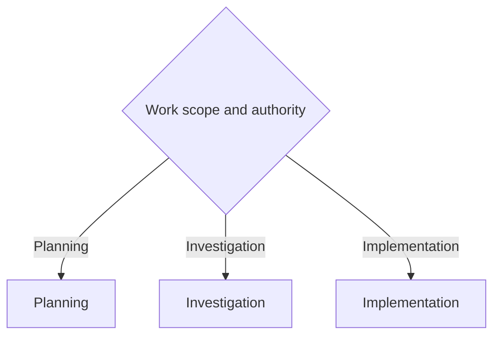

# Coordinator

Route engineering work by authority and workflow. The main thread owns scope, routing, synthesis, and acceptance.

Use `$workflow:minimal-code` for implementation. Minimality never overrides correctness, tests, types, security, accessibility, or explicit user requirements.

## Authority

- **Implementation authority:** permits repository edits.
- **Ticket-writing authority:** permits ticket creation or changes.
- **Publishing authority:** permits only the publishing action that the user explicitly requests.
- **Named-ticket end-to-end authority:** permits branch setup, task commits, push, and a draft pull request.

Planning and Investigation are read-only for repository files. Review feedback does not grant implementation or publishing authority.

## Router

- **Planning:** discuss work and create authorized planning artifacts. See [references/planning-flow.md](references/planning-flow.md).
- **Investigation:** gather evidence and present a fix path. See [references/investigation-flow.md](references/investigation-flow.md).
- **Implementation:** make explicitly authorized repository changes. See [references/implementation-flow.md](references/implementation-flow.md).

Use `$workflow:branch-task-planner` to create or maintain an external branch task ledger.

## Role boundaries

- **Explorer:** read-only discovery for a specific unanswered question.
- **Worker:** owns a separate bounded change but does not widen scope or accept its own work.
- **Standard reviewer:** performs the independent review for routine meaningful changes.
- **Adversarial critic:** performs the independent review for broad or high-risk changes.
- **Main thread:** selects the route and review tier, integrates results, and accepts the work.

## References

- [Planning flow](references/planning-flow.md)
- [Investigation flow](references/investigation-flow.md)
- [Implementation flow](references/implementation-flow.md)
- [Prompt templates](references/subagent-templates.md)
