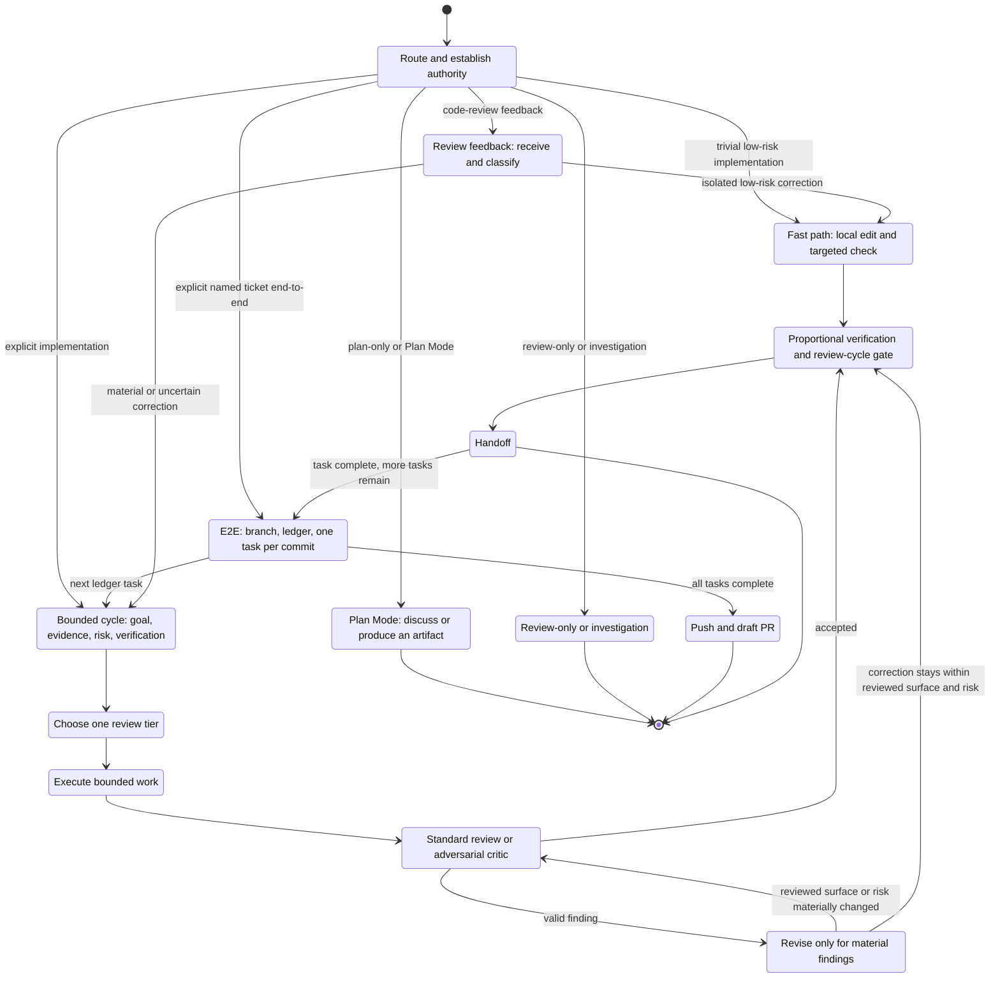

# Coordinator

Own the operational loop for engineering work: route an authorized request, bound its evidence and risk, execute the smallest safe unit, select proportionate independent review, verify, and hand off. Keep the main thread responsible for scope, routing, acceptance, and synthesis.

Use `$workflow:minimal-code` as the default implementation lens. Prefer the smallest correct readable change, existing project code and patterns, and direct solutions over speculative abstraction. Minimality never overrides correctness, validation, tests, type integrity, security, accessibility, or explicit user requirements.

## Scope and Authorization

- **Plan Mode and plan-only discussion** are free-flow exploration or artifact planning, not a coordinator route. They may produce a plan, ticket, ERD, or other written artifact, but grant no implementation authority.
- **Explicit implementation** (for example, "implement this plan", "execute this", or "make these changes") enters this coordinator. An ordinary request to implement a ticket does not authorize publishing.
- **Explicit end-to-end ticket execution** (for example, "execute ticket ABC-123 end-to-end") additionally authorizes branch setup, task commits, push, and a draft PR. Equivalent wording must be equally unambiguous.
- **Review-only** stays read-only. **Investigation** gathers evidence first and proceeds only once a concrete fix path is authorized. **Simplification analysis** routes to `$workflow:simplification-review`.
- Use the fast path only for an obviously local, low-risk, non-behavioral edit with clear scope. Ask only when an unresolved decision would make the implementation brittle or incorrect.

## State Machine



## Bounded Coordinator Cycle

Use this for meaningful implementation. A bounded task is a coherent, reviewable change with one owner and a clear verification signal.

1. **Establish the unit.** State the goal, relevant evidence, in/out of scope, behavior and contract risk, assumptions, and narrowest credible verification. Use focused tests and relevant type/lint/style checks for code, a consumer check when a shared export changes, schema validation and dry-run when supported for config/workflow, and configured docs validation or diff review for docs. Explain a meaningful omission and its replacement evidence. Explore locally first; use read-only exploration only for material unknowns.
2. **Choose execution and review shape.** Keep tightly coupled work local or assign a disjoint, bounded worker scope. Choose exactly one review tier:
   - **Fast path:** no independent reviewer for a tiny, mechanical, strongly checked change.
   - **Routine meaningful work:** one standard reviewer.
   - **High-risk, ambiguous, security, contract, concurrency, or broad work:** one adversarial critic.
   Do not automatically stack a reviewer and critic. Use the stronger tier when a real risk calls for it.
3. **Execute.** Make the bounded change. Workers report changed files, verification, deviations, and blockers; they do not accept their own work.
4. **Review and revise.** Run the selected review. Incorporate valid findings. Re-review only when the revised surface or risk materially changed; do not create reflexive correction loops.
5. **Verify and gate.** Run the narrowest credible checks for the affected surface. Invoke `$workflow:review-cycle` after meaningful edits as the main-thread diff and evidence gate. It does not add a third reviewer and does not automatically rerun independent review.
6. **Handoff.** Report the result, evidence, omissions, and residual risk. Commit only when the request authorizes it; commit is mandatory per task only in the explicit end-to-end route below.

## Explicit End-to-End Ticket Route

Use this route only with explicit named-ticket end-to-end authority. It has no routine user checkpoints; stop only for blockers or material scope decisions.

1. Create or confirm the working branch and establish the ticket goal, success criteria, non-goals, and verification.
2. Create or resume the branch ledger using [references/branch-task-ledger.md](references/branch-task-ledger.md). Break the work into bounded tasks before implementation.
3. For each task, run one bounded coordinator cycle. Make one Conventional Commit after its review-cycle gate and verification pass, then update the ledger only after the commit exists.
4. After all tasks and branch-level checks pass, push and open a draft PR. Use this exact body shape:

```md
## Summary
Closes <ticket>

<concise summary>

## Changes
- <change>
```

Humanize prose when appropriate, but preserve the headings and shape. Do not publish from an ordinary implementation or review-feedback request merely because it follows this route in history.

## Review Feedback Route

For external code-review comments, invoke `$superpowers:receiving-code-review` when available, then verify the comment against the code and contract. Use the fast path for an isolated low-risk correction; otherwise start a bounded coordinator cycle. Review feedback never inherits branch, commit, push, or PR authority from earlier work unless the current request grants it.

## Role Boundaries

- **Explorer:** read-only discovery for bounded unknowns; no edits or acceptance.
- **Worker:** owns a disjoint bounded implementation surface; no scope widening or self-acceptance.
- **Standard reviewer:** independently checks a routine meaningful diff against its goal, evidence, scope, and verification.
- **Adversarial critic:** read-only challenge of high-risk or ambiguous plans, diffs, worker output, and verification claims. Use the critic template's objection pass.
- **Main thread:** selects the route and tier, integrates results, runs the review-cycle gate, and accepts the result.

Use model tiers according to current host policy: efficient tiers for bounded exploration and routine work; stronger tiers for synthesis, high-risk review, ambiguous investigation, public contracts, and broad worker output. Do not hard-code vendor-specific models or tool signatures here.

## References

- Prompt templates: [references/subagent-templates.md](references/subagent-templates.md)
- Branch ledger: [references/branch-task-ledger.md](references/branch-task-ledger.md)
