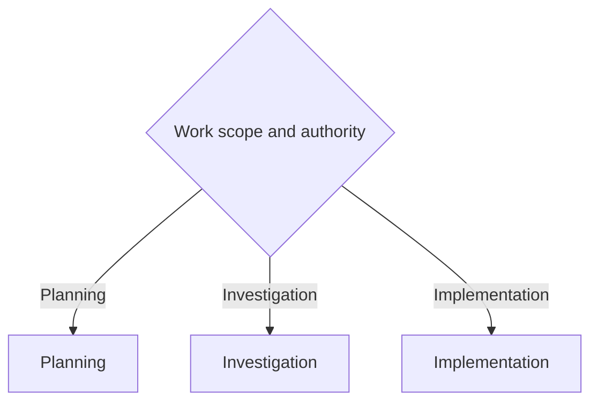

# Coordinator

Route engineering work by authority and workflow. The main thread owns scope, routing, synthesis, and acceptance.

Use `$workflow:minimal-code` for implementation. Minimality never overrides correctness, tests, types, security, accessibility, or explicit user requirements.

## Authority

- **Implementation authority:** permits repository edits.
- **External-artifact authority:** an explicit user request to create or update a named artifact under `~/.engineering-workflow` permits only that artifact write. It does not grant repository edits, setup, migration, ticket publishing, or other external writes.
- **Repository-document authority:** an explicit Grill With Docs request permits only selected existing repository documentation and qualifying ADR files. It does not grant code, configuration, specification, plan, ticket, commit, push, or publication changes.
- **Setup or migration authority:** an explicit user request to configure or migrate Engineering Workflow storage permits only the requested setup or migration operation.
- **Ticket-writing authority:** permits ticket creation or changes.
- **Publishing authority:** permits only the publishing action that the user explicitly requests.
- **Named-work-item end-to-end authority:** applies to a ticket, specification, or plan. It permits branch setup, required ledger maintenance, bounded commits, push, and a draft pull request.

Planning and Investigation are read-only for repository files. Review feedback does not grant implementation or publishing authority.

## Active slice

For meaningful implementation, state one active slice before edits. Name its outcome, boundary, and verification signal.

Inspect the Git state and preserve unrelated user changes. Keep the slice in the main-thread context and use Git as the worktree record.

Continue without another approval when the work is decision-complete. The fast path does not need a visible active slice.

Evaluate each new prompt against the active slice. Interrupt only for a material scope conflict. Use the prompt rules in the [implementation flow](references/implementation-flow.md).

## Router

- **Planning:** discuss work and create authorized planning artifacts. See [references/planning-flow.md](references/planning-flow.md).
- **Investigation:** gather evidence and present a fix path. See [references/investigation-flow.md](references/investigation-flow.md).
- **Implementation:** make explicitly authorized repository changes. See [references/implementation-flow.md](references/implementation-flow.md).

Use `$workflow:branch-task-planner` when the user requests an external ledger or authorizes named-work-item end-to-end execution. That route requires a ledger.

A manual-only skill can be an explicit nested invocation when the selected authorized route requires it. This does not waive the skill's authority checks.

## Role boundaries

- **Explorer:** read-only discovery for a specific unanswered question.
- **Worker:** owns a separate bounded change, tests it, and self-reviews it. It does not widen scope or accept its own work.
- **Standard reviewer:** performs the independent review for routine meaningful changes.
- **Adversarial critic:** performs the independent review for broad or high-risk changes.
- **Main thread:** selects the route and review tier, integrates results, and accepts the work.

Select an explicit registered profile for each delegation. Do not rely on the
main thread's inherited model or reasoning effort. Use the critic profile only
when the selected review tier is adversarial. Use a non-critic profile for
exploration, implementation, verification, and standard review.

Reuse an existing agent for follow-up work while its role and responsibility
stay the same. Spawn a new agent only when the responsibility changes or fresh
independence is required.

Use a fresh worker context for a ledger task when it reduces context load or adds useful isolation. Keep one writer for overlapping files.

## References

- [Planning flow](references/planning-flow.md)
- [Investigation flow](references/investigation-flow.md)
- [Implementation flow](references/implementation-flow.md)
- [Prompt templates](references/subagent-templates.md)
