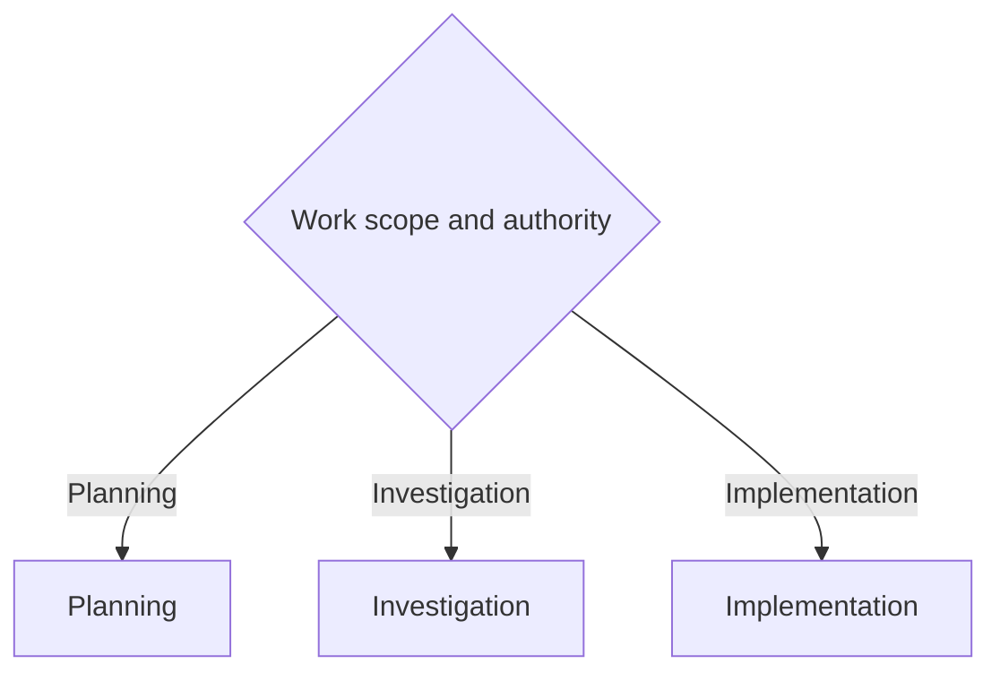

# Coordinator

Route engineering work to the smallest path that matches its authority and evidence. Keep the main thread responsible for scope, routing, acceptance, and synthesis.

Use `$workflow:minimal-code` as the default implementation lens. Minimality never overrides correctness, validation, tests, type integrity, security, accessibility, or explicit user requirements.

## Authority

- Planning may discuss work and create authorized planning artifacts, but it cannot implement, commit, or publish.
- Investigation gathers and validates evidence. It enters Implementation only after explicit fix authority.
- Implementation requires explicit change authority. Branch setup, task commits, push, and a draft PR require explicit named-ticket end-to-end authority.
- Review-only work stays read-only. Ticket drafting or mutation requires ticket-writing authority.

## Router

- **Planning:** discussion, planning artifacts, and explicitly requested user-involved branch-ledger planning. See [references/planning-flow.md](references/planning-flow.md).
- **Investigation:** evidence-first diagnosis that presents a validated fix path without implementing it. See [references/investigation-flow.md](references/investigation-flow.md).
- **Implementation:** explicitly authorized changes, review feedback, and named-ticket end-to-end execution. See [references/implementation-flow.md](references/implementation-flow.md).

## Role Boundaries

- **Explorer:** read-only discovery for a bounded unknown.
- **Worker:** owns a disjoint bounded change but does not widen scope or accept its own work.
- **Reviewer or critic:** independently reviews the assigned surface at the selected risk tier.
- **Main thread:** owns authority, routing, synthesis, the review-cycle gate, and final acceptance.

## References

- [Planning flow](references/planning-flow.md)
- [Investigation flow](references/investigation-flow.md)
- [Implementation flow](references/implementation-flow.md)
- [Prompt templates](references/subagent-templates.md)
- [Branch ledger](references/branch-task-ledger.md)
