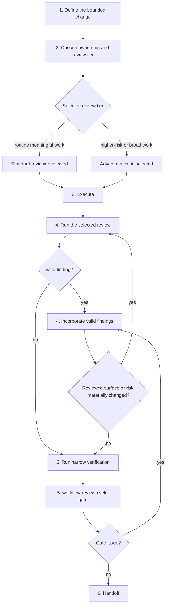
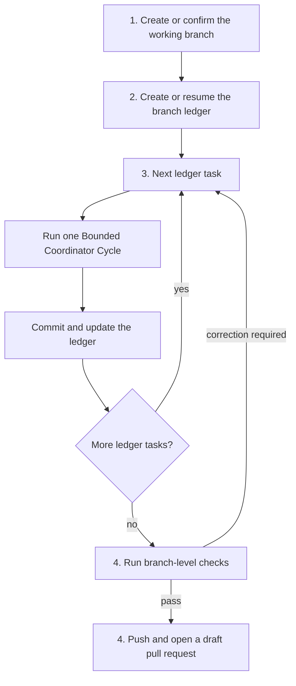
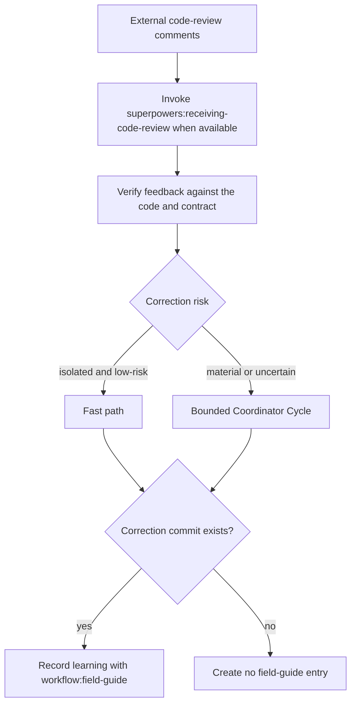

# Implementation Flow

Use this route only when the user explicitly authorizes implementation. Examples include “implement this plan,” “execute this,” or “make these changes.” Implementing an existing ticket does not authorize publishing.


## Authority and Fast Path

- Use the fast path only for an obviously local, low-risk, non-behavioral edit with clear scope. Make the edit, run a targeted check, and complete the review-cycle gate. No independent reviewer is required.
- Meaningful implementation follows the bounded coordinator cycle below.
- Review-only remains read-only. Simplification analysis routes to `$workflow:simplification-review`.
- Drafting, creating, or modifying a ticket requires ticket-writing authority. Executing an existing named ticket end-to-end has the additional authority requirements below.

## Bounded Coordinator Cycle



1. **Define the bounded change.** State the goal, evidence, scope, behavior risk, contract risk, assumptions, and narrowest credible verification. For code, use focused tests and relevant type, lint, and style checks. Check consumers after shared export changes. Use supported schema checks and dry-runs for configuration or workflow changes. Use configured validation or a focused diff review for documentation. Explain omitted checks and provide replacement evidence. Explore locally first. Use read-only exploration only for material unknowns.
2. **Choose ownership and review tier.** Keep tightly related work local or assign a separate, bounded worker scope. Choose exactly one independent review tier for meaningful work:
   - **Routine meaningful work:** prefer the runtime's native or default code-review capability when it can inspect the actual diff and evidence and return a review result. Otherwise, use one read-only standard reviewer with the standard reviewer template.
   - **Higher-risk or broad work:** use one read-only adversarial critic with the critic template. This includes ambiguous, security, contract, or concurrency risk.
   Do not automatically stack a reviewer and critic.
3. **Execute.** Make the bounded change. Workers report changed files, verification, deviations, and blockers. They do not accept their own work.
4. **Review and revise.** Run the selected review and apply valid findings. Repeat the review only after a material change to the reviewed area or risk.
5. **Verify and gate.** Run the narrowest credible checks for the affected area. Invoke `$workflow:review-cycle` after meaningful edits. It confirms the completed review or invokes the missing tier, applies valid findings, and does not duplicate a review that still covers the current surface and risk.
6. **Handoff.** Report the result, evidence, omissions, and residual risk. Commit only when the request authorizes it.

## Explicit Named-Ticket End-to-End Route

Use this route only with explicit named-ticket end-to-end authority, such as “execute ticket ABC-123 end-to-end.” This authority includes branch setup, task commits, push, and a draft pull request. Equivalent wording must be equally clear. Do not add routine user checkpoints. Stop only for blockers or material scope decisions.



1. Create or confirm the working branch and establish the ticket goal, success criteria, non-goals, and verification.
2. Create or resume the branch ledger using [branch-task-ledger.md](branch-task-ledger.md). Break the work into bounded tasks before implementation.
3. For each task, run one bounded coordinator cycle. Make one Conventional Commit after its review-cycle gate and verification pass, then update the ledger only after the commit exists.
4. After all tasks, run branch-level checks. If a check requires a correction, add or resume a bounded ledger task and repeat step 3. When the checks pass, push and open a draft pull request with this exact body shape:

```md
## Summary
Closes <ticket>

<concise summary>

## Changes
- <change>
```

Humanize prose when appropriate, but preserve the headings and shape. Publish only when the current request grants publishing authority.

## Review Feedback Route



For external review comments, invoke `$superpowers:receiving-code-review` when available. Verify each comment against the code and contract. Use the fast path for an isolated, low-risk correction. Use a bounded coordinator cycle for a material or uncertain correction. After a correction commit exists, invoke `$workflow:field-guide` to record the lesson. Without a correction commit, create no field-guide entry. Review feedback inherits no branch, commit, push, or pull-request authority unless the current request grants it.

## Role Boundaries

- **Explorer:** read-only discovery for specific unanswered questions. It cannot edit or accept work.
- **Worker:** owns a separate bounded implementation area. It cannot widen scope or accept its own work.
- **Standard reviewer:** the runtime's native or default code-review capability when it can inspect the actual diff and evidence and return a review result, or a read-only reviewer using the standard template. It independently checks a routine meaningful diff against its goal, evidence, scope, and verification.
- **Adversarial critic:** read-only challenge of high-risk or ambiguous plans, diffs, worker output, and verification claims. Use the critic template's objection pass.
- **Main thread:** selects the route and tier, integrates results, runs the review-cycle gate, and accepts the result.

Use model tiers according to current host policy. Use efficient tiers for bounded exploration and routine work. Use stronger tiers for synthesis, high-risk review, ambiguous investigation, public contracts, and broad worker output. Do not specify vendor models or tool signatures here.
