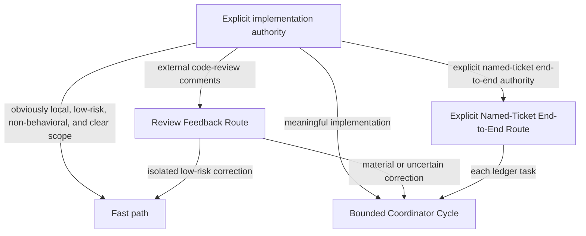
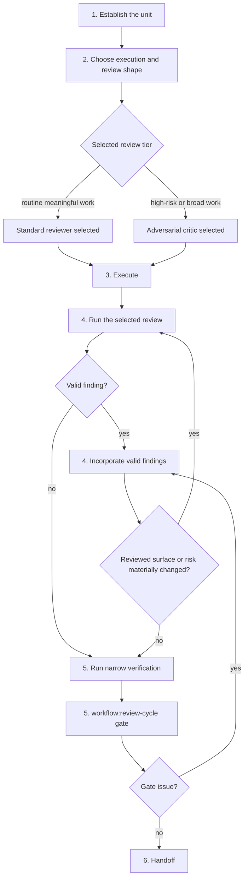
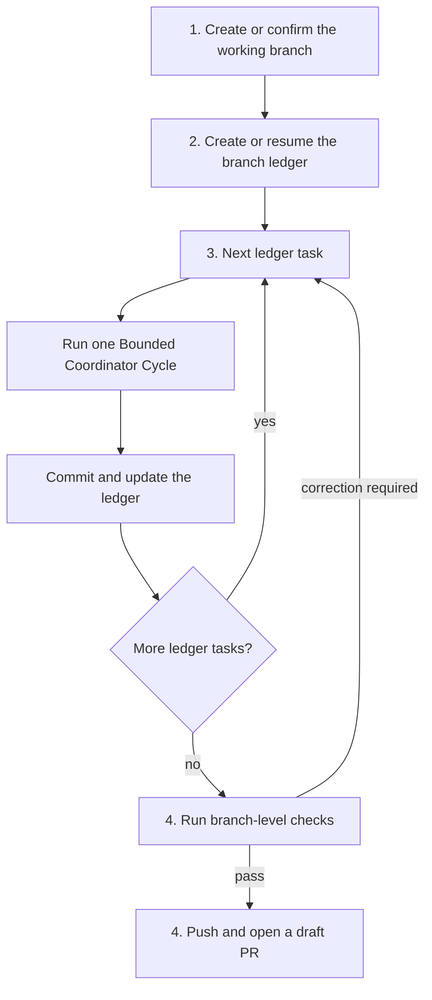
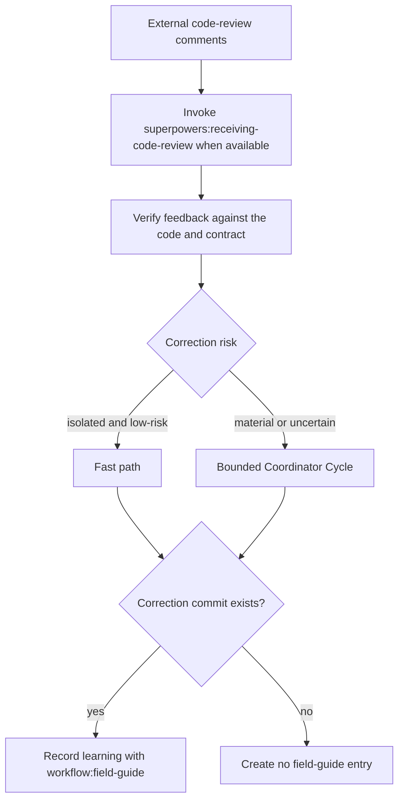

# Implementation Flow

Use this route only when the user explicitly authorizes implementation, for example: “implement this plan”, “execute this”, or “make these changes.” An ordinary request to implement an existing ticket does not authorize publishing.



## Authority and Fast Path

- Use the fast path only for an obviously local, low-risk, non-behavioral edit with clear scope. Make the edit, run a targeted check, and complete the review-cycle gate. No independent reviewer is required.
- Meaningful implementation follows the bounded coordinator cycle below.
- Review-only remains read-only. Simplification analysis routes to `$workflow:simplification-review`.
- Drafting, creating, or modifying a ticket requires ticket-writing authority. Executing an existing named ticket end-to-end has the additional authority requirements below.

## Bounded Coordinator Cycle



1. **Establish the unit.** State the goal, evidence, in/out of scope, behavior and contract risk, assumptions, and narrowest credible verification. Use focused tests and relevant type/lint/style checks for code; consumer checks for shared exports; schema validation and dry-runs when supported for config or workflow; and configured docs validation or focused diff review for docs. Explain a meaningful omission and its replacement evidence. Explore locally first; use read-only exploration only for material unknowns.
2. **Choose execution and review shape.** Keep tightly coupled work local or assign a disjoint, bounded worker scope. Choose exactly one independent review tier for meaningful work:
   - **Routine meaningful work:** one standard reviewer.
   - **High-risk, ambiguous, security, contract, concurrency, or broad work:** one adversarial critic.
   Do not automatically stack a reviewer and critic.
3. **Execute.** Make the bounded change. Workers report changed files, verification, deviations, and blockers; they do not accept their own work.
4. **Review and revise.** Run the selected review. Incorporate valid findings. Re-review only when the revised surface or risk materially changed; do not create reflexive correction loops.
5. **Verify and gate.** Run the narrowest credible checks for the affected surface. Invoke `$workflow:review-cycle` after meaningful edits as the main-thread diff and evidence gate. It does not add a third reviewer and does not automatically rerun independent review.
6. **Handoff.** Report the result, evidence, omissions, and residual risk. Commit only when the request authorizes it.

## Explicit Named-Ticket End-to-End Route

Use this route only with explicit named-ticket end-to-end authority, for example: “execute ticket ABC-123 end-to-end.” It additionally authorizes branch setup, task commits, push, and a draft PR. Equivalent wording must be equally unambiguous. It has no routine user checkpoints; stop only for blockers or material scope decisions.



1. Create or confirm the working branch and establish the ticket goal, success criteria, non-goals, and verification.
2. Create or resume the branch ledger using [branch-task-ledger.md](branch-task-ledger.md). Break the work into bounded tasks before implementation.
3. For each task, run one bounded coordinator cycle. Make one Conventional Commit after its review-cycle gate and verification pass, then update the ledger only after the commit exists.
4. After all tasks, run branch-level checks. If a check requires a correction, add or resume a bounded ledger task and repeat step 3. When the checks pass, push and open a draft PR with this exact body shape:

```md
## Summary
Closes <ticket>

<concise summary>

## Changes
- <change>
```

Humanize prose when appropriate, but preserve the headings and shape. Do not publish from an ordinary implementation or review-feedback request merely because it follows this route in history.

## Review Feedback Route



For external code-review comments, invoke `$superpowers:receiving-code-review` when available, then verify the comment against the code and contract. Use the fast path for an isolated low-risk correction; otherwise start a bounded coordinator cycle. After an addressed correction is committed, invoke `$workflow:field-guide` to record the committed learning. If no correction commit exists, create no field-guide entry. Review feedback never inherits branch, commit, push, or PR authority from earlier work unless the current request grants it.

## Role Boundaries

- **Explorer:** read-only discovery for bounded unknowns; no edits or acceptance.
- **Worker:** owns a disjoint bounded implementation surface; no scope widening or self-acceptance.
- **Standard reviewer:** independently checks a routine meaningful diff against its goal, evidence, scope, and verification.
- **Adversarial critic:** read-only challenge of high-risk or ambiguous plans, diffs, worker output, and verification claims. Use the critic template's objection pass.
- **Main thread:** selects the route and tier, integrates results, runs the review-cycle gate, and accepts the result.

Use model tiers according to current host policy: efficient tiers for bounded exploration and routine work; stronger tiers for synthesis, high-risk review, ambiguous investigation, public contracts, and broad worker output. Do not hard-code vendor-specific models or tool signatures here.
