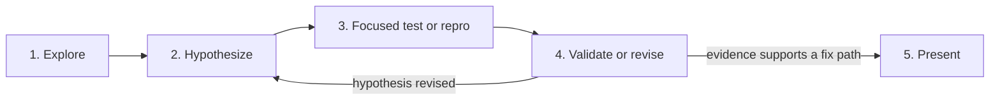

# Investigation Flow

Use this read-only route to establish a credible fix path before implementation is authorized.

1. **Explore.** Start with focused local reads and existing evidence. Use a read-only explorer only for a real bounded unknown.
2. **Hypothesize.** State the suspected cause, affected surface, and disconfirming evidence to seek. Do not treat source inspection alone as proof.
3. **Focused test or repro.** Run the smallest practical test, reproduction, or inspection that can distinguish the hypothesis from alternatives. For CI failures, reproduce the named failure locally first; a local pass is evidence to rerun or investigate flakiness rather than guess at source code.
4. **Validate or revise.** Compare the result to the hypothesis. Revise it and repeat the focused test or repro until the evidence supports a concrete fix path or proves the issue remains unknown.
5. **Present.** Report the evidence, likely cause, recommended minimal fix, verification needed, and residual uncertainty. Stop unless the user separately grants implementation authority.

Investigation may inspect existing tickets, plans, and code, but drafting, creating, or modifying a ticket requires ticket-writing authority. It cannot edit source, commit, push, open a PR, or otherwise publish work.
