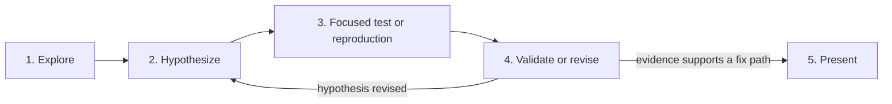

# Investigation flow

Use this read-only route to establish a credible fix path.

1. **Explore.** Read focused files and existing evidence.
2. **Hypothesize.** State the suspected cause and affected area.
3. **Define disproof.** Identify evidence that could disprove the hypothesis.
4. **Reproduce.** Run the smallest check that distinguishes the hypothesis from alternatives.
5. **Validate.** Compare the result with the hypothesis.
6. **Revise.** Repeat the focused check when the evidence changes the hypothesis.
7. **Present.** Report the evidence, likely cause, minimal fix path, required verification, and residual uncertainty.

For CI failures, reproduce the named failure locally first. A local pass supports a rerun or flakiness investigation.

Investigation cannot edit repository files, commit, or publish. Use ticket-writing authority before you create or change a ticket.
