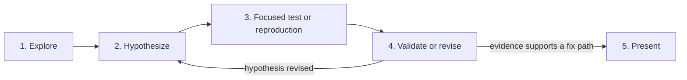

# Investigation flow

Use this read-only route to establish a credible fix path.

Invoke `$workflow:systematic-debugging` for a bug, failing test, build failure, CI failure, performance problem, or unexpected behavior.

For a user-invoked code review, select one reviewer tier. Apply every code review lens in [subagent prompt templates](subagent-templates.md).

1. **Explore.** Read focused files, errors, logs, and existing evidence.
2. **Reproduce.** Run the narrowest credible command or exact user steps.
3. **Hypothesize.** State one suspected cause and its evidence.
4. **Define disproof.** Identify evidence that could disprove the hypothesis.
5. **Validate.** Compare the result with the hypothesis.
6. **Revise.** Repeat the focused check when the evidence changes the hypothesis.
7. **Present.** Report the evidence, likely cause, minimal fix path, required verification, and residual uncertainty.

For CI test failures, reproduce the named failure locally before source analysis. A local pass supports a rerun or infrastructure investigation.

Investigation cannot edit repository files, commit, or publish. Use ticket-writing authority before you create or change a ticket.
