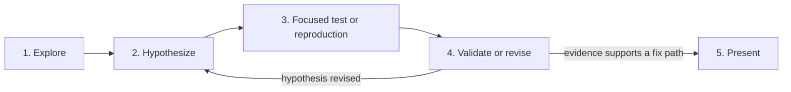

# Investigation Flow

Use this read-only route to establish a credible fix path before implementation is authorized.

1. **Explore.** Start with focused local reads and existing evidence. Use a read-only explorer only for a real bounded unknown.
2. **Hypothesize.** State the suspected cause, affected area, and evidence that could disprove the hypothesis. Do not treat source inspection alone as proof.
3. **Focused test or reproduction.** Run the smallest practical check that distinguishes the hypothesis from alternatives. For CI failures, reproduce the named failure locally first. A local pass supports a CI rerun or a flakiness investigation, not a guess about source code.
4. **Validate or revise.** Compare the result with the hypothesis. Revise it and repeat the focused check until evidence supports a fix path or the issue remains unresolved.
5. **Present.** Report the evidence, likely cause, recommended minimal fix, verification needed, and residual uncertainty. Stop unless the user separately grants implementation authority.

Investigation may inspect existing tickets, plans, and code. Ticket creation or changes require ticket-writing authority. Investigation cannot edit source, commit, push, open a pull request, or publish.
