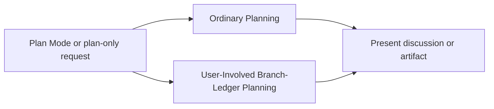

# Planning Flow

Use this route for Plan Mode, plan-only discussion, or written planning artifacts. It grants no implementation authority.

## Ordinary Planning

- Discuss options or produce an artifact such as a plan, ticket draft, ERD, or other written deliverable.
- Gather bounded read-only evidence when it materially improves the artifact. Do not delegate implementation.
- Draft, create, or modify a ticket only when the request grants ticket-writing authority.
- State material assumptions, risks, and open decisions. Planning ends with the artifact or discussion. It does not enter implementation automatically.

## User-Involved Branch-Ledger Planning

Use [branch-task-ledger.md](branch-task-ledger.md) only when the user asks to plan with a branch ledger on an established branch. Keep the user involved in task boundaries, intended commits, and material decisions.

- Confirm the live repository root and current branch before creating or resuming the external ledger.
- This route may create or update the external ledger. It cannot create or switch branches, edit repository files, commit, push, open a pull request, or publish.
- Do not create or refresh a repository-local ledger pointer in this route.
- Record proposed bounded tasks, expected outcomes, verification, and risks. Tasks remain `[ ]` until an explicitly authorized implementation route completes and commits them.
- A later implementation request must grant its own authority. Only explicit named-ticket end-to-end authority enables the automatic per-task commit and publish loop.
