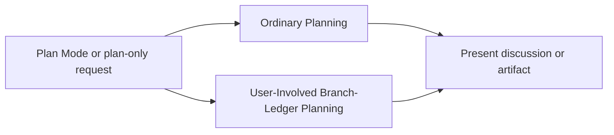

# Planning flow

Use this route for Plan Mode, plan-only discussion, or written planning artifacts. This route grants no implementation authority.

## Ordinary planning

1. Discuss options or produce the requested planning artifact.
2. Gather bounded read-only evidence when it improves the artifact.
3. Use ticket-writing authority before you create or change a ticket.
4. State material assumptions, risks, and open decisions.
5. End with the artifact or discussion.

## User-involved branch-ledger planning

Use [branch-task-ledger.md](branch-task-ledger.md) only when the user requests an external ledger for an established branch.

1. Confirm the live repository root and branch.
2. Create or update only the external ledger.
3. Keep every proposed task marked `[ ]`.
4. Record task boundaries, expected outcomes, verification, and risks.
5. Request new authority before implementation.

Manual ledger planning cannot create or switch branches. It cannot edit repository files, commit, or publish.
